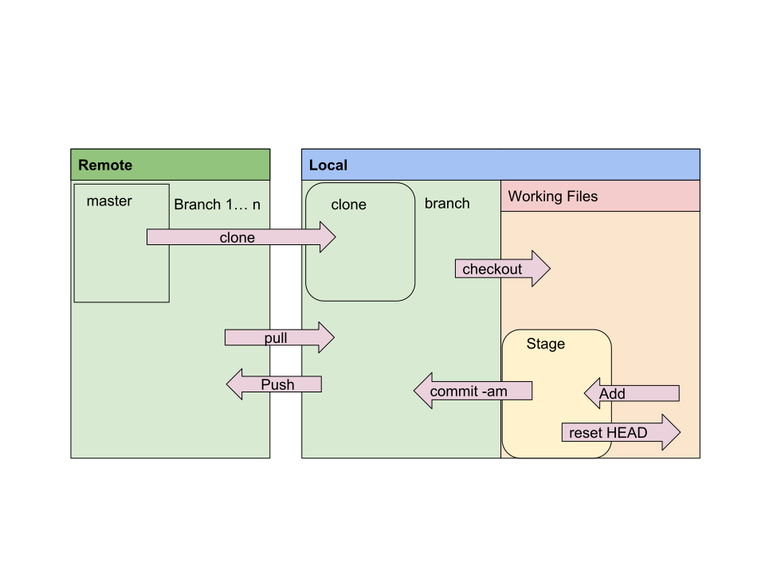

# Terms
 1. Repository (remote & local):
 2. Branch (remote & local)
 3. checkout, diff and commit
 4. clone, push and pull
 5. merge, rebase, apply patch

# Workflow

# example
 1. git clone git@github.com:amitmh/hello-git.git
 2. [do your changes; say in README.md ]
 3.a `$git status` should give you modified file name
 3.b `$git diff README.md` this will give you changes with respect to master. 
 3.c `$git add README.md`
 4. `$git commit -am 'add this comment'`
 5. `$git push` this will upload changes to remote