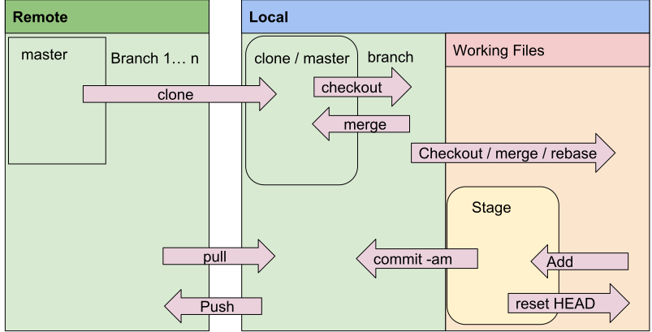

# Terms
 1. Repository (remote & local):
 2. Branch (remote & local)
 3. checkout, diff, tags and commit
 4. clone, push and pull
 5. merge, rebase, apply patch

# Workflow

# example
 0. [incase of doubt use `git status`]
 1. git clone git@github.com:amitmh/hello-git.git
 2. [a] `checkout -b branch-name`
 2. [b] do your changes; say in README.md 
 3. [a] `git status` should give you modified file name
 3. [b] `git diff README.md` this will give you changes with respect to master. 
 3. [c] `git add README.md`
 4. `$git commit -am 'add this comment'`
 5. `$git push --set-upstream origin branch-name` this will upload changes to remote
 6. [a] to merge changes in master raise pull request or
 6. [b][1] `git checkout master`
 6. [b][2] `git merge feature`
 7. [b][3] `git push`
 